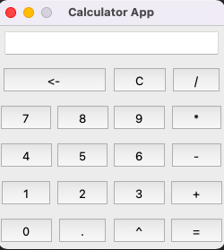

# Calculator App
This python script creates a Calculator GUI application.

### Examples



### Running the script
```commandline
python calculator.py
```

### Libraries used
- tkinter
- functools

### *Author Name*
[Mohamed El Hacen Habib](https://github.com/mohamedelhacen)